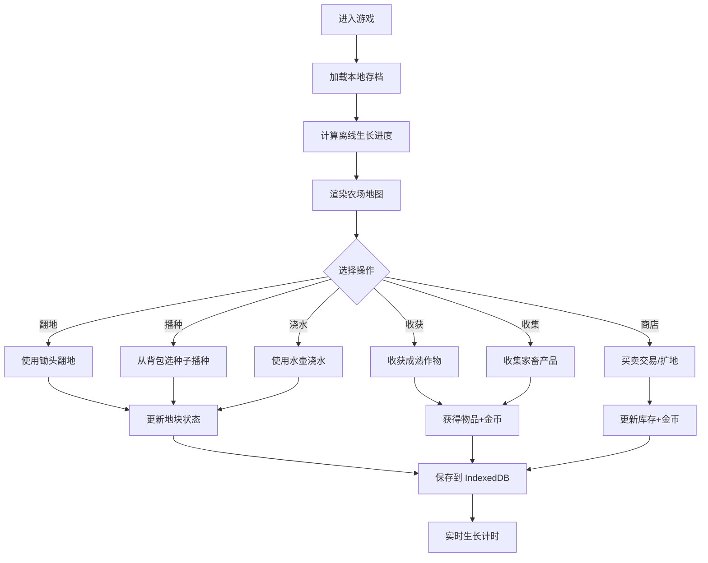

## 1. 产品概述

像素风农场经营小游戏，玩家在虚拟农场中通过种植作物、养殖家畜、买卖商品来经营发展自己的农场。支持离线生长和本地存档，带来轻松休闲的经营体验。

- 核心玩法：地块种植、家畜养殖、商店交易、农场扩张
- 目标用户：喜欢休闲经营类游戏的玩家
- 产品价值：碎片化时间娱乐，离线成长机制带来持续游玩动力

## 2. 核心功能

### 2.1 用户角色

| 角色 | 注册方式 | 核心权限 |
|------|----------|----------|
| 玩家 | 本地存档自动创建 | 完整游戏体验，本地数据存储 |

### 2.2 功能模块

1. **主游戏界面**：Phaser 渲染的农场地图、地块网格、家畜区域
2. **地图网格模块**：地块状态管理、翻地操作、四季画面切换
3. **作物生长模块**：播种、浇水、生长、收获，支持真实时间离线生长
4. **家畜系统模块**：鸡下蛋、牛产奶，定时产出机制
5. **库存背包模块**：物品管理、种子/道具/农产品存储
6. **商店买卖模块**：购买种子、出售农产品、扩地升级

### 2.3 页面详情

| 页面名称 | 模块名称 | 功能描述 |
|----------|----------|----------|
| 主游戏界面 | 地图渲染 | Phaser 3 渲染像素风农场，可交互地块 |
| 主游戏界面 | 顶部状态栏 | 显示金币、当前季节、时间信息 |
| 主游戏界面 | 底部工具栏 | 背包、商店、工具选择按钮 |
| 背包弹窗 | 库存展示 | 格子化展示所有物品，支持物品使用 |
| 商店弹窗 | 交易系统 | 购买种子/动物、出售农产品、扩展地块 |
| 操作面板 | 交互反馈 | 翻地、播种、浇水、收获操作提示 |

## 3. 核心流程

玩家进入游戏后，首先查看当前农场状态。选择工具（锄头/水壶/手），点击地块进行翻地、播种、浇水操作。作物成熟后收获，获得农产品和金币。养殖的鸡和牛会定时产出鸡蛋和牛奶。玩家可通过商店出售农产品换取金币，购买新种子或扩展更多地块。

## 4. 用户界面设计

### 4.1 设计风格

- **像素风主题**：16x16 像素风格，复古游戏美学
- **主色调**：绿色系（农场草地）、棕色系（土地）、暖黄色（UI 边框）
- **辅助色**：春季嫩绿、夏季深绿、秋季金黄、冬季雪白
- **按钮风格**：像素风凸起按钮，带像素边框和点击凹陷效果
- **字体**：像素风格等宽字体，数字清晰可辨
- **布局**：固定像素网格布局，中心游戏区 + 顶部状态栏 + 底部工具栏
- **图标**：纯像素绘制的图标，保持风格统一

### 4.2 页面设计概述

| 页面名称 | 模块名称 | UI 元素 |
|----------|----------|----------|
| 主游戏界面 | 地图区域 | 12x12 像素地块网格，每个地块 64x64 像素，可点击交互 |
| 主游戏界面 | 状态栏 | 像素金币图标、季节图标、日期显示，像素字体 |
| 主游戏界面 | 工具栏 | 锄头、水壶、手、背包、商店五个像素按钮，选中高亮 |
| 背包弹窗 | 物品格子 | 6x6 格子布局，物品图标+数量，悬浮显示详情 |
| 商店弹窗 | 商品列表 | 分购买/出售两个标签页，商品卡片带价格和数量选择 |
| 通用 | 像素边框 | 所有弹窗使用 4px 像素风格边框，圆角 0px |

### 4.3 响应性

- 桌面端优先，固定 1024x768 游戏画布
- 支持窗口缩放，保持像素清晰度
- 鼠标交互为主要操作方式

### 4.4 游戏画面指引

- **四季切换**：
  - 春季：浅绿草地，粉色花朵点缀
  - 夏季：深绿草地，作物生长旺盛
  - 秋季：金黄草地，落叶效果
  - 冬季：白雪覆盖，冷色调滤镜
- **作物动画**：分幼苗、生长、成熟三个阶段的像素帧动画
- **浇水效果**：水滴粒子动画，土地变深色
- **收获效果**：物品弹跳+金币飞入动画
