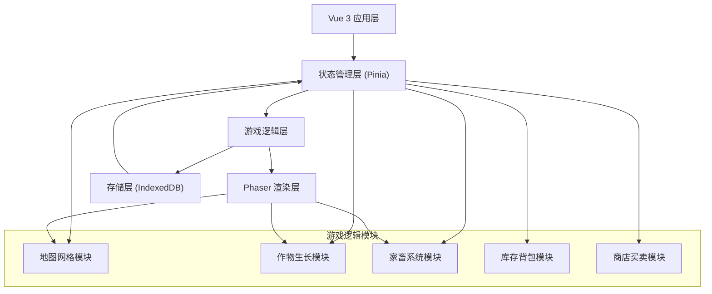
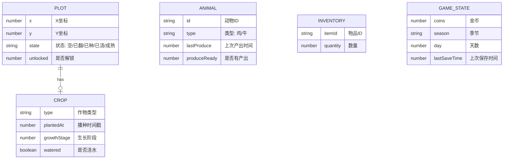

## 1. 架构设计



## 2. 技术描述

- **前端框架**：Vue 3.4 + TypeScript + Vite 5
- **游戏引擎**：Phaser 3.80
- **状态管理**：Pinia 2.1
- **本地存储**：IndexedDB (idb 库封装)
- **样式方案**：TailwindCSS 3.4
- **像素字体**：Press Start 2P (Google Fonts)

## 3. 目录结构

```
src/
├── game/
│   ├── phaser/          # Phaser 场景和渲染
│   │   ├── scenes/
│   │   │   ├── FarmScene.ts
│   │   │   └── BootScene.ts
│   │   ├── sprites/     # 像素精灵定义
│   │   └── textures/    # 程序化生成纹理
│   ├── modules/         # 游戏逻辑模块
│   │   ├── MapGrid.ts   # 地图网格模块
│   │   ├── CropGrowth.ts # 作物生长模块
│   │   ├── Livestock.ts # 家畜系统模块
│   │   ├── Inventory.ts # 库存背包模块
│   │   └── Shop.ts      # 商店买卖模块
│   ├── stores/          # Pinia 状态管理
│   │   ├── gameStore.ts
│   │   └── useGameStore.ts
│   ├── db/              # IndexedDB 封装
│   │   ├── index.ts
│   │   └── schema.ts
│   ├── data/            # 游戏配置数据
│   │   ├── crops.ts     # 作物配置
│   │   ├── animals.ts   # 家畜配置
│   │   └── items.ts     # 物品配置
│   └── types/           # TypeScript 类型定义
│       └── game.ts
├── components/          # Vue 组件
│   ├── GameCanvas.vue
│   ├── StatusBar.vue
│   ├── ToolBar.vue
│   ├── InventoryModal.vue
│   └── ShopModal.vue
├── App.vue
└── main.ts
```

## 4. 数据模型

### 4.1 ER 图



### 4.2 核心类型定义

```typescript
// 地块状态
type PlotState = 'empty' | 'tilled' | 'planted' | 'watered' | 'ready';

// 季节
type Season = 'spring' | 'summer' | 'autumn' | 'winter';

// 地块
interface Plot {
  x: number;
  y: number;
  state: PlotState;
  unlocked: boolean;
  crop?: Crop;
}

// 作物
interface Crop {
  type: string;
  plantedAt: number;
  watered: boolean;
  lastGrowthCheck: number;
}

// 家畜
interface Animal {
  id: string;
  type: 'chicken' | 'cow';
  lastProduceTime: number;
  hasProduct: boolean;
}

// 物品
interface Item {
  id: string;
  name: string;
  type: 'seed' | 'product' | 'animal';
  price: number;
  sellPrice: number;
  icon: string;
}

// 作物配置
interface CropConfig {
  id: string;
  name: string;
  growthTime: number; // 毫秒
  stages: number;
  sellPrice: number;
  seedPrice: number;
  seasons: Season[];
}
```

## 5. 核心模块接口

### 5.1 地图网格模块 (MapGrid)

```typescript
class MapGrid {
  getPlot(x: number, y: number): Plot | undefined;
  tillPlot(x: number, y: number): boolean;
  unlockPlot(x: number, y: number): boolean;
  canUnlock(x: number, y: number): boolean;
  getUnlockedCount(): number;
  getUnlockPrice(x: number, y: number): number;
  getSeason(): Season;
  advanceDay(): void;
}
```

### 5.2 作物生长模块 (CropGrowth)

```typescript
class CropGrowth {
  plantSeed(x: number, y: number, cropType: string): boolean;
  waterPlot(x: number, y: number): boolean;
  harvest(x: number, y: number): { itemId: string; quantity: number } | null;
  calculateGrowth(crop: Crop, currentTime: number): number; // 返回生长阶段 0-1
  isReadyToHarvest(crop: Crop): boolean;
  processOfflineGrowth(plots: Plot[], offlineMs: number): void;
}
```

### 5.3 家畜系统模块 (Livestock)

```typescript
class Livestock {
  getAnimals(): Animal[];
  addAnimal(type: 'chicken' | 'cow'): boolean;
  collectProduct(animalId: string): { itemId: string; quantity: number } | null;
  processOfflineProduction(animals: Animal[], offlineMs: number): void;
  getAnimalPrice(type: 'chicken' | 'cow'): number;
}
```

### 5.4 库存背包模块 (Inventory)

```typescript
class Inventory {
  getItems(): Map<string, number>;
  addItem(itemId: string, quantity: number): void;
  removeItem(itemId: string, quantity: number): boolean;
  hasItem(itemId: string, quantity: number): boolean;
  getItemCount(itemId: string): number;
}
```

### 5.5 商店买卖模块 (Shop)

```typescript
class Shop {
  getBuyableItems(): Array<{ item: Item; stock: number }>;
  getSellableItems(): Array<{ item: Item; quantity: number }>;
  buyItem(itemId: string, quantity: number): boolean;
  sellItem(itemId: string, quantity: number): boolean;
  getExpandPlotPrice(): number;
  expandPlot(): boolean;
}
```

## 6. 存储层设计

### IndexedDB 存储结构

```typescript
const DB_SCHEMA = {
  name: 'PixelFarmDB',
  version: 1,
  stores: [
    {
      name: 'gameState',
      keyPath: 'id',
      data: {
        id: 'main',
        coins: 100,
        season: 'spring',
        day: 1,
        lastSaveTime: Date.now()
      }
    },
    {
      name: 'plots',
      keyPath: ['x', 'y'],
      indexes: [
        { name: 'state', keyPath: 'state' }
      ]
    },
    {
      name: 'animals',
      keyPath: 'id'
    },
    {
      name: 'inventory',
      keyPath: 'itemId'
    }
  ]
};
```
